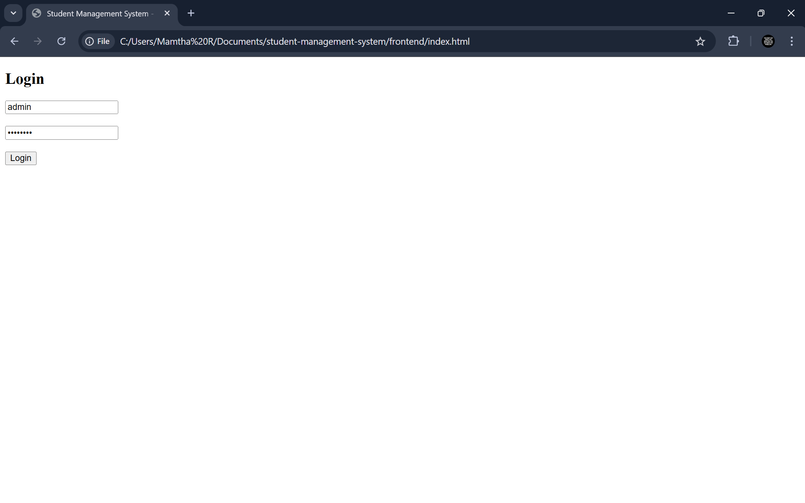
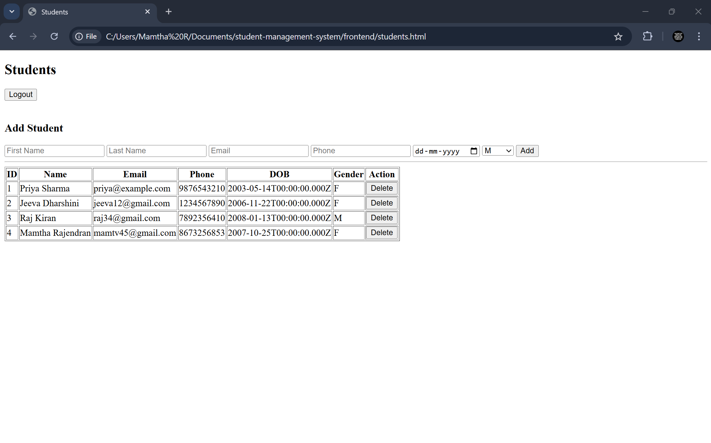
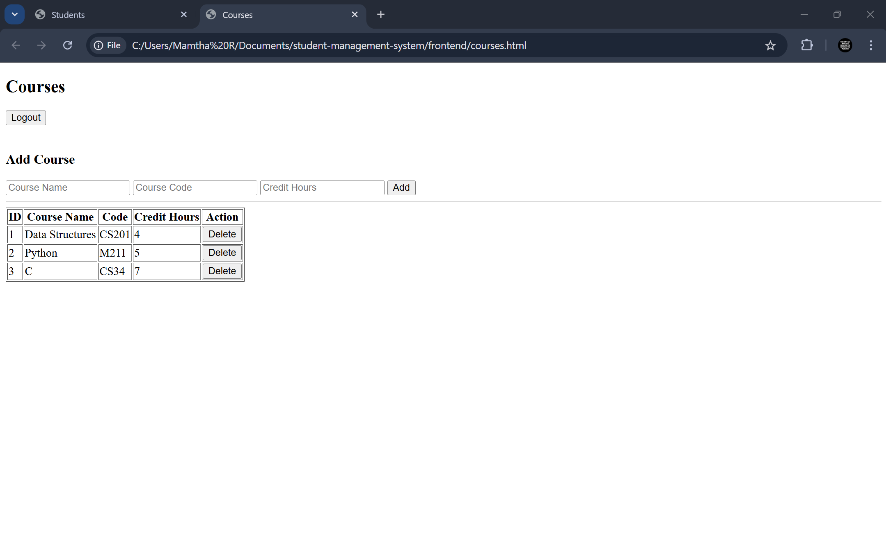

# Student Management System (Full-Stack CRUD + Authentication)

A full-stack Student Management System developed to demonstrate relational CRUD operations, secure authentication, REST API architecture, and frontend-backend integration using Node.js, Express, Sequelize ORM, MySQL, and Vanilla JavaScript. This project is suitable for internships, academic assessments, learning full-stack development, and portfolio demonstration.

---

## 🚀 Tech Stack

### Frontend:
- HTML
- CSS
- JavaScript (Fetch API)

### Backend:
- Node.js
- Express.js
- Sequelize ORM
- JWT Authentication
- BCrypt Password Hashing

### Database:
- MySQL (Relational SQL Database)

---

## 🔐 Authentication & Authorization Features

✔ JWT-based login  
✔ Password hashing using bcrypt  
✔ Token validation on protected API routes  
✔ Role-based access (Admin / Staff)  
✔ Prevents unauthorized operations  

---

## 📦 Core System Features

✔ CRUD operations for Students  
✔ CRUD operations for Courses  
✔ Enrollment Module (Many-to-Many)  
✔ Search, Filter, Sorting features  
✔ Form validation (client + server)  
✔ RESTful API best practices  
✔ Organized MVC backend structure  
✔ Secure DB queries using ORM  
✔ Works fully offline (HTML-based frontend)

---

## 📊 System Architecture (High-Level)

Frontend (HTML + JS)
↓ (Fetch API)
Backend (Node.js + Express)
↓ (Sequelize ORM)
Database (MySQL)

---

## 🛢 Database Design

**Entities:**
- Users
- Students
- Courses
- Enrollments

**Relationships:**

Students ↔ Courses (Many-to-Many via Enrollments)

This models real academic systems like LMS/SIS.

---

## 🧪 Backend Installation & Setup

1. Navigate to backend folder:

cd backend

2. Install dependencies:

npm install

3. Configure MySQL in:

backend/config/config.json

4. Start MySQL Server
5. Run backend:

node server.js

Backend starts at:

http://localhost:3000

---

## 🖥 Frontend Usage

1. Open frontend folder
2. Open `index.html` in browser
3. Login with admin credentials
4. Manage:
✔ Students  
✔ Courses  
✔ Enrollments  

---

## 🖼 Screenshots (UI Preview)

### Login Page

### Students Module

### Courses Module

### Enrollment Module

---

## 📘 Use Cases

This project can be used for:

✔ Internship Submission  
✔ College Mini/Major Project  
✔ Full-Stack Learning  
✔ CRUD + Auth Demonstration  
✔ Resume / Portfolio Project  

---

## 🧩 Key Learnings

During the development of this project, major topics learned include:

✔ Authentication Workflow (JWT)  
✔ Password Security (bcrypt)  
✔ REST API Integration  
✔ State Management (Token storage)  
✔ Relational Database Modeling  
✔ Sequelize ORM + SQL Concepts  
✔ MVC Backend Architecture  
✔ Full-Stack Development Principles  

## 🙋 Author

**Mamtha Rajendran**

Open to internship opportunities in:
- Full Stack Development
- Backend Engineering
- Web Development
- Software Engineering

---

